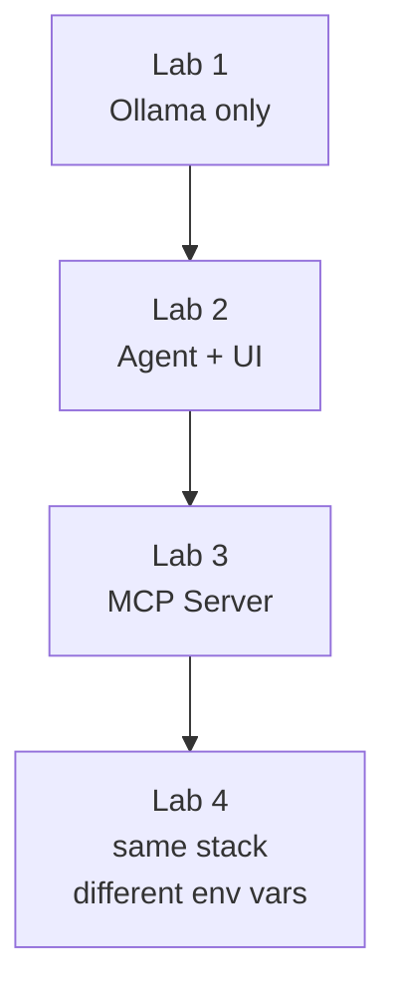

{}
Look at the very top of this page, **above the "Setup & Prerequisites" title**:

- **Haven't chosen yet?** You will see *Choose your deployment path* with two buttons —
  **Docker Compose** and **Kubernetes / Helm**. They are buttons, not labels. **Click one.**
  The setup steps further down this page stay hidden until you do.
- **Already chosen?** You will see a padlock line naming your current path, with a
  **Switch to …** button beside it.

**Your choice is not permanent and it is not a commitment.** The padlock line and its
**Switch to …** button appear at the top of *every* page in this workshop, so you can change
paths at any point — nothing you have already done is lost by switching.

Only one path's commands are ever shown to you. That is deliberate: running the Docker
commands *and* the Kubernetes commands is the most common way to get stuck in this workshop.
{}

## Which path should I choose?

Both paths deploy the **same four containers** and end at the same working lab. They differ
only in *where* the containers run and *how* you drive them. Nothing in Labs 1–4 depends on
which one you pick.

| | Docker Compose | Kubernetes / Helm |
|---|---|---|
| **Runs on** | Your own machine (laptop, VM, or workstation) | An existing Kubernetes cluster |
| **You work from** | Your own terminal | Azure Cloud Shell |
| **You need** | Docker Engine 24+, Compose v2.20+, Git, `jq`, 8 GB free RAM, 5 GB disk | `kubectl` 1.28+, Helm 3.14+, `jq`, a running cluster, a default StorageClass |
| **Per-lab command** | `docker compose up` | `helm upgrade --install` |
| **Reaching the lab UI** | Directly on `localhost` | `kubectl port-forward`, plus Cloud Shell web preview |
| **GPU** | Optional — cuts model load from ~60 s to ~5 s | Not used |
| **Setup time** | ~15 minutes | ~20 minutes |
| **Cleanup** | `docker compose down` | `helm uninstall` |

### Choose **Docker Compose** if…

- You are **not** continuing from another workshop — this is the default, and the shortest route
  to a working lab.
- You have Docker on the machine in front of you and at least 8 GB of RAM free.
- You want the fastest feedback loop: containers restart in seconds and everything is on
  `localhost`.
- You do not have a Kubernetes cluster, or do not want to spend lab time on one.

<!-- TODO (manual): add the concrete "why you'd want this" specifics — e.g. offline or
     air-gapped use, a corporate laptop with no cluster access, wanting to inspect the
     running containers directly from a shell. -->

### Choose **Kubernetes / Helm** if…

- You are **continuing from the [Kubernetes 101 workshop](https://fortinetcloudcse.github.io/k8s-101-workshop/)**
  and already have a cluster and an Azure Cloud Shell session. This is the main reason to pick it.
- Your organisation runs FortiAIGate and its protected workloads on Kubernetes, and you want the
  lab to match how you would actually deploy it.
- You want to see the Helm chart, the manifests, and how the pieces map to Services and
  PersistentVolumeClaims.
- Your own machine cannot spare 8 GB of RAM, but your cluster can.

<!-- TODO (manual): add the concrete "why you'd want this" specifics — e.g. which parts of the
     FortiAIGate integration only look realistic in-cluster, and anything a participant should
     know about node sizing or the shared cluster used on the day. -->

{}
Unless you are arriving from the Kubernetes 101 workshop, **Docker Compose** is the right choice.
It has fewer prerequisites and fewer things that can go wrong, and you can switch to the
Kubernetes path later from the control at the top of any page.
{}

## Stack overview

The lab application is four containers wired together with Docker Compose (or Helm
for Kubernetes). Each lab adds one layer:

The single configuration value that controls which LLM the agent talks to is
`OPENAI_BASE_URL`. By default it points at the local Ollama container. If you
want to route through FortiAIGate instead, that is the only value you change —
the agent image, MCP server, and UI are identical.

## Your setup steps

The panel below shows the setup steps **for your chosen path only**. If you see the
*Choose your deployment path* buttons at the top of this page instead of steps, you have not
picked a path yet — click one and the steps appear here.


{}
**Run everything on your own machine.** Recommended unless you are continuing from
the Kubernetes 101 workshop.

| | |
|---|---|
| Requires | Docker Engine + Compose v2, Git, ~8 GB RAM free |
| GPU | Optional — speeds up model loading, not required |
| Setup time | ~15 minutes |

➔ **Continue: [Docker Compose Setup](./1_prereqs_docker)**
{}
{}
**Deploy to a Kubernetes cluster with Helm.** For attendees continuing from the
[K8s 101 workshop](https://fortinetcloudcse.github.io/k8s-101-workshop/), who already
have a cluster and an Azure Cloud Shell session.

| | |
|---|---|
| Requires | `kubectl` 1.28+, Helm 3.14+, `jq` 1.6+, a running cluster, a default StorageClass |
| Node size | Ollama needs ≥ 4 GB RAM on the node it schedules to |
| Setup time | ~20 minutes |

➔ **Continue: [Kubernetes / Helm Setup](./2_prereqs_k8s)**
{}


{}
Your path selection is stored per workshop site, so it does not carry over from
K8s 101 — clicking **Kubernetes / Helm** at the top of this page is what sets it here.
{}
