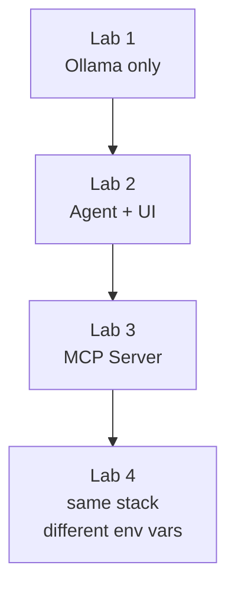

## Stack overview

The lab application is four containers wired together with Docker Compose (or Helm
for Kubernetes). Each lab adds one layer:

The single configuration value that controls which LLM the agent talks to is
`OPENAI_BASE_URL`. By default it points at the local Ollama container. If you
want to route through FortiAIGate instead, that is the only value you change —
the agent image, MCP server, and UI are identical.

## Choose your path

Every lab in this workshop has two sets of commands. **Pick your path below.** Your
choice is remembered for the whole workshop — from here on, each lab shows your
path's commands automatically, and the top of every lab page tells you which path
you are on.


{}
**Run everything on your own machine.** Recommended unless you are continuing from
the Kubernetes 101 workshop.

| | |
|---|---|
| Requires | Docker Engine + Compose v2, Git, ~8 GB RAM free |
| GPU | Optional — speeds up model loading, not required |
| Setup time | ~15 minutes |

➔ **Continue: [Docker Compose Setup](./1_prereqs_docker)**
{}
{}
**Deploy to a Kubernetes cluster with Helm.** For attendees continuing from the
[K8s 101 workshop](https://fortinetcloudcse.github.io/k8s-101-workshop/), who already
have a cluster and an Azure Cloud Shell session.

| | |
|---|---|
| Requires | `kubectl` 1.28+, Helm 3.14+, `jq` 1.6+, a running cluster, a default StorageClass |
| Node size | Ollama needs ≥ 4 GB RAM on the node it schedules to |
| Setup time | ~20 minutes |

➔ **Continue: [Kubernetes / Helm Setup](./2_prereqs_k8s)**
{}


{}
Your path selection is stored per workshop site, so it does not carry over from
K8s 101 — clicking **Kubernetes / Helm** above is what sets it here.
{}
