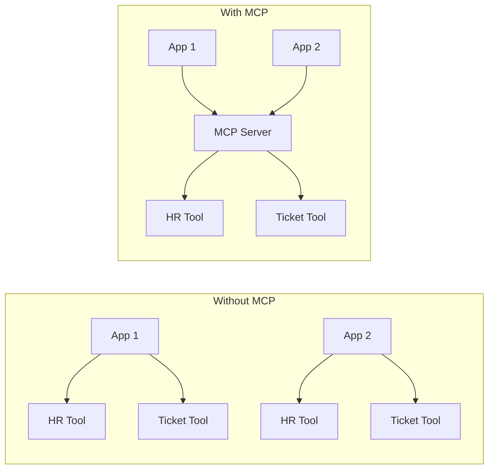
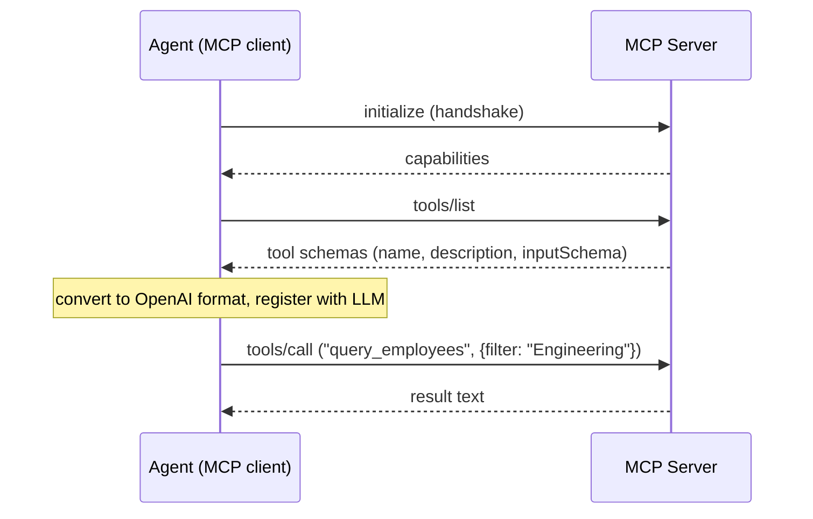

This page covers the theory behind MCP: the problem it solves, how the protocol
works at the wire level, and what dynamic tool discovery means for both
capability and security. The hands-on portion is in [Lab 3](1_lab/).

By the end of this page you should be able to explain:
- What the M×N integration problem is and how MCP collapses it
- The three MCP transports and which one this workshop uses
- The two-phase interaction: discovery (list_tools) and execution (call_tool)
- How tool schemas flow from the MCP server into the LLM request
- Why dynamic discovery creates an attack surface that static tool lists do not

---

## The problem MCP solves

Before MCP, every AI application that wanted to call an external tool had to
write a custom integration. A security posture check tool, a ticketing system,
a CMDB, a code execution sandbox — each one required its own client library,
auth flow, schema definition, and error handling. N applications times M tools
equals N×M bespoke connectors to build and maintain.



MCP introduces a standard protocol so that any MCP-capable agent can talk to
any MCP-compliant server without knowing in advance what tools that server
exposes. The agent asks "what can you do?" and the server answers with a list
of tool schemas in a format the agent already knows how to use.

This is not a new idea — it is essentially what LSP (Language Server Protocol)
did for IDE tooling in 2016. MCP applies the same pattern to AI agents. The
[MCP specification](https://spec.modelcontextprotocol.io/specification/) is
open; Anthropic proposed it and it has since been adopted by major providers
and tool vendors.

---

## What MCP exposes

MCP servers can expose three types of primitives:

| Primitive | Description |
|-----------|-------------|
| **Tools** | Functions the model can call. This is what the labs use. |
| **Resources** | Data the model can read (files, database rows, API responses). The agent requests them explicitly rather than the model calling a function. |
| **Prompts** | Reusable prompt templates the model can invoke by name. Useful for standardising common task patterns. |

This workshop focuses on tools exclusively, but the other two primitives follow
the same discovery pattern — the agent asks, the server responds with a schema,
the agent uses it.

---

## Transports

MCP defines three transport options. The agent and server negotiate which one
to use during the initialization handshake.

| Transport | How it works | When to use |
|-----------|-------------|-------------|
| **stdio** | Agent spawns the server as a child process; they communicate over stdin/stdout | Local tools on the same machine |
| **SSE** (deprecated) | Server-sent events over HTTP; older spec | Legacy deployments |
| **Streamable HTTP** | HTTP POST for requests, streaming for responses; current spec | Remote servers, containers, production |

This workshop uses **streamable HTTP** on port 8000 at path `/mcp`. The agent
container reaches the MCP server container at `http://mcp-server:8000/mcp`
using the Docker service hostname.

{}
The MCP SDK's HTTP server includes DNS rebinding protection by default — it
rejects requests from hostnames other than `localhost` and `127.0.0.1`. In a
Docker network, the agent container reaches the MCP server by hostname
(`mcp-server`), not localhost, which would be rejected.

The lab's `server.py` disables this check with
`TransportSecuritySettings(enable_dns_rebinding_protection=False)`. In
production, you would instead use a proper reverse proxy or TLS with verified
hostnames rather than disabling this protection.
{}

{}
Streamable HTTP runs over standard HTTP, so any HTTP auth mechanism applies:
API keys in a header, mutual TLS, or OAuth 2.0 (which the MCP spec explicitly
supports). This lab has no auth — treat MCP server endpoints the same as any
internal API: require authentication before accepting connections.
{}

---

## JSON-RPC 2.0: the wire format

You will hear "JSON-RPC" whenever MCP is discussed. It is worth understanding
what it actually is, because it explains several things about MCP that seem odd
if you expect a conventional REST API.

**JSON-RPC 2.0** is a lightweight remote procedure call protocol. Instead of
mapping operations to HTTP verbs and URL paths, every operation is a POST to
the same endpoint with a JSON body that names the method:

```json
{
  "jsonrpc": "2.0",
  "id": 1,
  "method": "tools/list",
  "params": {}
}
```

The server responds with:

```json
{
  "jsonrpc": "2.0",
  "id": 1,
  "result": {
    "tools": [
      {
        "name": "query_employees",
        "description": "Look up employees in the HR database by department name.",
        "inputSchema": { "type": "object", "properties": { "filter": { "type": "string" } } }
      }
    ]
  }
}
```

A tool call looks like this on the wire:

```json
{
  "jsonrpc": "2.0",
  "id": 2,
  "method": "tools/call",
  "params": {
    "name": "query_employees",
    "arguments": { "filter": "Engineering" }
  }
}
```

You rarely write this JSON directly — the MCP SDK does it for you. But it is
useful to know what is actually crossing the wire when debugging or when reading
MCP server logs.

### Why not REST?

REST maps operations to resource URLs: `GET /employees`, `POST /messages`. MCP
is RPC-style: there is one URL (`/mcp`) and the operation name is inside the
body. This is a deliberate choice:

- **Tool calls are not resources.** Calling `query_employees` is an action, not
  a resource retrieval. RPC maps to this naturally.
- **Sessions require state.** Unlike REST (which is stateless), MCP maintains a
  session after `initialize`. The server can remember capabilities negotiated
  at handshake time.
- **Bidirectional.** MCP servers can send notifications back to the client
  (progress updates, log messages) without the client polling. This fits
  streaming HTTP better than REST conventions.

### The challenge: two kinds of error

JSON-RPC has a structured error format:

```json
{
  "jsonrpc": "2.0",
  "id": 2,
  "error": { "code": -32601, "message": "Method not found" }
}
```

This covers protocol-level failures: unknown method, invalid request format,
internal server error. But when a tool itself fails — the database is
unreachable, the SQL query throws — that is *not* a JSON-RPC error. It comes
back as a successful JSON-RPC response with `isError: true` inside `content`:

```json
{
  "jsonrpc": "2.0",
  "id": 2,
  "result": {
    "content": [{ "type": "text", "text": "{\"error\": \"no such table: employees\"}" }],
    "isError": true
  }
}
```

The distinction matters for error handling in your agent code: JSON-RPC errors
mean the MCP call itself failed; `isError: true` in the result means the tool
ran but the underlying operation failed. The agent loop in this workshop
propagates both as tool results — the model sees the error text and decides
what to do next.

### The initialize handshake

Every MCP session starts with an `initialize` request where client and server
exchange capability declarations:

```json
{ "method": "initialize", "params": {
    "protocolVersion": "2025-03-26",
    "capabilities": { "roots": {}, "sampling": {} },
    "clientInfo": { "name": "ai-101-agent", "version": "1.0" }
  }
}
```

The server responds with its own version and which primitives it supports
(tools, resources, prompts). The client then sends an `initialized`
notification to confirm. Only after this exchange can the client call
`tools/list` or `tools/call`.

In the agent code, `await session.initialize()` handles all of this. The
reason a new session is opened for every tool call in this workshop's
implementation (rather than holding one open) is simplicity — production
implementations would maintain a persistent session per server.

---

## The protocol: discovery and execution

Every interaction between an MCP client (the agent) and an MCP server follows
the same two-phase pattern.



### Phase 1: Discovery (list_tools)

The agent opens an HTTP session to the MCP server, completes the initialize
handshake, and calls `list_tools`. The server returns an array of tool
definitions, each with:

- `name` — the function identifier.
- `description` — natural language description the model reads.
- `inputSchema` — JSON Schema describing the expected parameters.

The agent converts these into OpenAI-format tool schemas and stores them in
`_schemas`. This is the only place where MCP and OpenAI formats differ slightly;
the conversion is one line per field.

### Phase 2: Execution (call_tool)

When the agent loop receives a `tool_calls` response from the model, it opens
a *new* HTTP session to the MCP server (sessions are not reused between calls
in this implementation), completes the handshake again, and calls `call_tool`
with the function name and arguments. The server executes the function and
returns the result as text.

From the agent loop's perspective, this is identical to calling a local Python
function. The `_run_tool()` abstraction hides which backend is active.

---

## Dynamic discovery: power and risk

The key capability Lab 3 demonstrates is that an MCP server can add tools at
runtime, and the agent can pick them up without restarting:

1. MCP server starts with two tools.
2. Agent discovers those two tools at startup.
3. Operator sets `ENABLE_EXTRA_TOOL=true` and restarts only the MCP server.
4. Agent calls `/tools/refresh` — rediscovers, now sees three tools.
5. Model can immediately call the new tool.

No agent restart. No code change. No redeploy.

This is powerful for the same reason it is dangerous. The tools the model can
call are not determined at development time — they are determined at runtime
by whatever the MCP server currently exposes. If an attacker can influence what
the MCP server returns (by compromising the server, injecting into its database,
or substituting a malicious server), they can add tools the model will call, or
modify descriptions to embed hidden instructions.

The Lab 4 security demo (`POISON_DESC=true`) shows the latter: the description
of `search_web` is replaced with a string that embeds hidden instructions
telling the model to exfiltrate data before running the search. The model reads
tool descriptions the same way it reads any other text in the context window —
as instructions.

---

## How the agent talks to the MCP server

From `main.py`, the discovery call:

```python
async with streamablehttp_client(MCP_BASE_URL) as (read, write, _):
    async with ClientSession(read, write) as session:
        await session.initialize()
        result = await session.list_tools()

_schemas = [
    {
        "type": "function",
        "function": {
            "name":        t.name,
            "description": t.description or "",
            "parameters":  t.inputSchema,
        },
    }
    for t in result.tools
]
```

And the execution call:

```python
async with streamablehttp_client(MCP_BASE_URL) as (read, write, _):
    async with ClientSession(read, write) as session:
        await session.initialize()
        result = await session.call_tool(name, args)

return result.content[0].text
```

The agent loop calls `_run_tool(name, args)` regardless of mode. `_run_tool`
dispatches to the MCP path when `TOOL_MODE=mcp`. The loop itself has no
knowledge of MCP at all.

---

## The server side

For completeness: here is how a tool is registered on the server. The entire
server-side definition for `query_employees` in `lab-app/images/mcp-server/server.py`:

```python
from mcp.server.fastmcp import FastMCP

mcp = FastMCP("AI-101 HR Tools")

@mcp.tool()
def query_employees(filter: str) -> str:
    """Look up employees in the HR database by department name."""
    # implementation ...
```

Three things to note:
- The **decorator** (`@mcp.tool()`) registers the function with the MCP server.
- The **docstring** becomes the `description` field the model reads during discovery.
- The **type annotations** (`filter: str`) are converted to the `inputSchema` automatically.

That is the complete server-side contract. The client (agent) never sees the
implementation — only the name, description, and schema that the decorator
derives from the function signature.

---

## Quick reference

### MCP primitives

| Primitive | Used in this lab | Model interacts via |
|-----------|-----------------|---------------------|
| Tools | Yes | `finish_reason: tool_calls` |
| Resources | No | Explicit resource-read request |
| Prompts | No | Prompt-get request |

### MCP vs hardcoded comparison

| Aspect | Hardcoded (Lab 2) | MCP (Lab 3+) |
|--------|------------------|--------------|
| Tool source | `tools.py` in agent image | MCP server at runtime |
| Add a new tool | Rebuild agent image | Restart MCP server only |
| Tool execution | Direct function call | HTTP to MCP server |
| Agent loop code | Unchanged | Unchanged |
| Security surface | Fixed at build time | Dynamic — server controls schema |

### Environment variables (MCP server)

| Variable | Default | Effect |
|----------|---------|--------|
| `ENABLE_EXTRA_TOOL` | `false` | Adds `search_web` tool without agent restart |
| `POISON_DESC` | `false` | Replaces `search_web` description with hidden instructions (Lab 4) |
| `DB_PATH` | `/app/employees.db` | SQLite database path |
